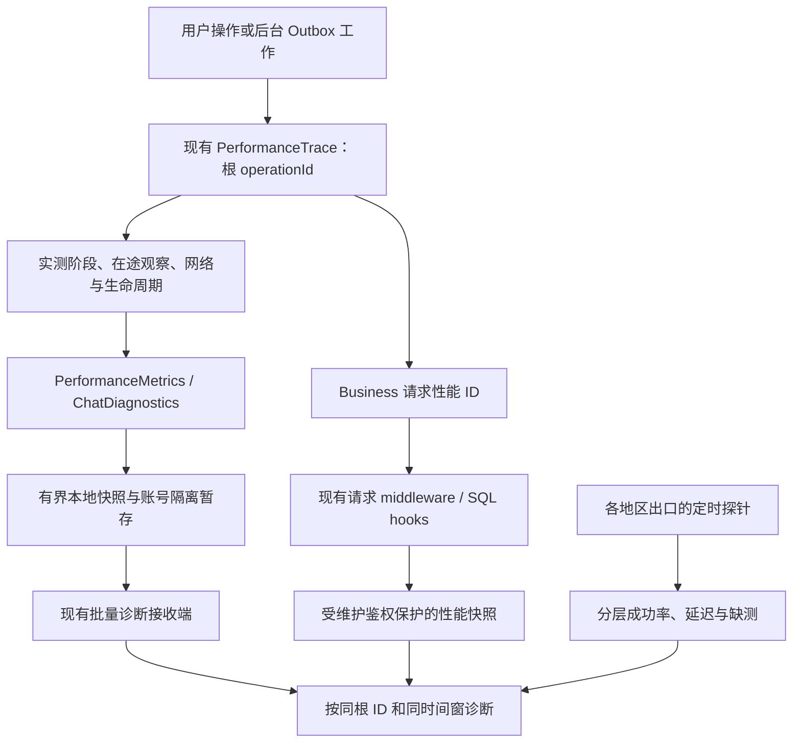

# 网络稳定性与全链路诊断修补设计

日期：2026-09-26，香港时间。状态：**待实施的修复方案**。用户本轮要求提供方案；本文件不代表代码修复、装机或生产切换已经完成。

## 1. 证据与目标

源码基线 `971fb50d193ab1a34610bd7908c2dbf6272db431`。只读证据见 [审计报告](../../verification/artifacts/2026-09-26/network-coverage-audit/findings.md)；该目录为本地验证工件，未作为公开日志发布。

| 已确认事实 | 修复要达到的结果 |
| --- | --- |
| 雷电 2179 存量日志中有 Business 请求超时、Matrix sync 失败；同一设备公开请求曾连接超时，随后六次成功中两次 TCP 建连约 1.2 秒 | 在同一时间窗定位失败发生于 TCP、TLS、请求处理还是客户端；稳定性结论覆盖晚高峰，不能用一次 200 结案 |
| 13.229.60.153 多条路径连接超时，SSH 未进入认证 | 恢复正确管理入口，核实服务角色后才评价业务可用性；不把连接超时解释成 PEM 无效 |
| 旧 TCP22 探针无连接截止时间，曾运行 99 秒；689 个分钟槽中缺 342 个 | 每分钟有明确测量结果，缺测与网络失败分别计数；定时器 active 不再被当成网络健康 |
| main 中新暂存与 network_request 未进入已安装的 2179；生产仅升级接收端，尚无源码中的请求/DB 性能 hooks | 建立源码、最终 APK/IPA、生产镜像三份能力清单，用实测证明功能已上线 |
| 未完成 trace 不进入 snapshot；视频第一次失败后 trace 已 finish | 卡住时能看到最后实测阶段和等待时长，重试仍能关联到原操作 |
| 多个 API 子操作可共用根 operationId；本地恢复目前按 operationId 去重 | 保留同根下的每条真实记录，上传 ACK 不移除后来加入的同根记录 |

当前尚不能确认具体运营商、路由器、TUN/NAT 或服务器防火墙是雷电故障根因。主服务器自身 443 成功和单个大陆 ECS 成功，不能排除终端路径故障。Matrix 成功长轮询约 34 秒不能自动归为卡顿。

## 2. 方案选择

| 方案 | 取舍 |
| --- | --- |
| **推荐：按证据修复网络，同时补齐既有诊断与交付** | 网络与客户端源码可以独立推进；先消除观测盲区，再针对失败层改配置，影响范围可控 |
| 只增加超时、切 DNS 或随机 IP 轮询 | 会掩盖长尾且不修复缺测、重试和发布差异；不作为本次主方案 |
| 立即增加另一套采集平台或重写业务/SDK | 增加运行成本和迁移风险；现有 PerformanceMetrics、ChatDiagnostics 和服务端 hooks 已可扩展 |

### 数据流

## 3. P0：网络恢复与探针可信度

### 3.1 次服务器与雷电路径

1. 通过 13 节点云控制台核对实例状态、公网 IP、实际 SSH 用户/端口、安全组/网络 ACL；通过控制台会话查监听、sshd 和路由。管理规则仅放行所需来源。TEE.pem 继续只用于本地 SSH 参数，保持主机指纹校验。
2. 正确入口恢复后核实是否运行 Business、Matrix、TURN 或仅承担观测；按真实角色测试，不要求观测节点一定开放业务 443。
3. 雷电与宿主机用相同预算、同一时间窗做域名和固定 IPv4 对照。固定 IP 仍保留域名 SNI 和证书校验。比较 TCP、TLS、首字节、总时长；失败后的阶段为 null。
4. 若宿主机正常而雷电异常，检查模拟器 NAT、DNS/代理与出口；若两者同时异常，检查共同出口和上游路径；若多地区都异常，结合源站 listener、网关上游和主机资源检查。只有证据成立才修改对应配置。
5. 宿主机 TUN 的关闭对照会影响用户网络时，先取得该操作的明确安排；它不是本方案默认动作。捕获或输出只保留脱敏汇总，不保存消息、请求正文或原始用户网络日志。

13 节点实际用户/端口及目标用户地区的问题已在审计阶段提出；答案缺失只阻断对应节点恢复及区域选点，不阻断诊断源码修补。

### 3.2 旧 netmon 与新探针

复用 `scripts/netmon_tcp_probe.py` 的计时、错误枚举和容量限制。旧管理入口测量每分钟一次、单次 3 秒截止，service 8 秒兜底；已有主站 443 每分钟三次、service 15 秒兜底保持。所有任务禁止重叠。

旧脚本保留备份并改为调用有界探针；旧日志保留，新日志仍为有界 JSONL。目标以闭集类别表示，管理探针与业务探针不同列；次节点实际端口确认后才冻结 allowlist。

- 网络测量：成功或闭集错误；失败 `tcp_connect_ms=null`，`attempt_elapsed_ms` 为真实耗时。
- 运行结果：完成一次失败测量可以 exit 0；脚本/存储故障有单独错误和非零退出码。
- 采集质量：期望分钟、实际分钟、缺分钟单独展示；缺测不写成 offline 或 timeout。
- 外部 HTTPS 探针可以使用自己真实取得的 DNS/TCP/TLS/TTFB 数据；这些数据不冒充 Flutter 请求的阶段。

## 4. P0：在途、重试和关联正确性

### 4.1 根 ID 与队列身份

一次用户操作的所有阶段和子请求沿用根 `operation_id`。在现有 ChatDiagnostics 队列内增加私有、随机 UUID 的 `queue_entry_id`；它只用于本地入队、spool 与 ACK，不上传、不作为账号身份。

本地 spool 升级为 v3，兼容读取 v2。旧 v2 中同 operationId 的不同记录逐条保留，不能仅按根 ID 丢弃。ACK 只移除已经发送的队列快照条目；期间新增的同根 API/重试记录必须保留。容量继续 100 条、64 KiB、24 小时，账号代次/盐隔离和串行 I/O 保持。

既有 `network_request` 是聚合事件，UUID 代表聚合条目，不把它改称某一次用户操作。需要操作关联时，由现有 rich `apiRequest` 记录携带根 ID、endpoint_category 和 typed error。

### 4.2 在途观察

扩展现有 recorder 的有界 snapshot：根 ID、operation、最后阶段、阶段累计时间、当前已等待时间、生命周期、已测网络状态。观察期限集中在现有 PerformanceThresholds：会话从 T0 观察 45 秒，文本/视频/普通媒体最长观察 5 分钟；通话用周期窗口而非无限单条 trace。

P0先提供本地 typed 在途视图与过期观察，释放诊断槽位，**不取消业务 Future、不改变发送/登录结果、不触发业务重试**。根关联由现有 job 持有的小型 correlation context 保留，账号切换失效；recorder不无限保存已过期对象。后续真实完成可以保留同根 ID 形成新的完成观察。Release远程在途上报要先扩展严格协议：`observation_kind`区分checkpoint/expired/final，`observed_elapsed_ms`只表示已观察时长，不冒称已完成total。部分记录不得伪装failed/slow终态，只有已完成记录进入完成耗时分位数。

采用一个 recorder 维护定时观察，不为每个 mark 建立 Timer；active 仍最多 100，阶段最多 64。mark/record 不排序、不编码、不做磁盘或网络 I/O。

### 4.3 会话与发送

- 列表、搜索、通知和好友入口在第一个 await 前建立 trace；参数传至 navigation、RoomPage、timeline、sync，覆盖前置 policy/identity 等待。
- 后台 Outbox 和临时 lease 发送接入现有 messageSend trace；进程内恢复沿用根 ID，跨进程缺关联时明确标记新观察，不保存原始 txid/roomId。
- 视频等待网络、自动/手动重试不提前销毁根关联；每次实际执行新建attempt span并继承同context，失败仅结束该attempt。使用有界 attempt_index/retry_count，实际失败与最终结果分别观察，准备复用时不补造转码阶段。新增闭集协议字段由接收端先部署；视频队列没有真实持久化时不伪造outbox_persist。
- `timelinePublished` 与实际首帧可见分开：投影 publish 只能证明数据已交给 UI；只有真实 post-frame/可见回调才标记绘制完成。旧 `timelineVisible` 字段不被静默重新解释，更新文档和兼容测试。
- 失败型 Matrix sync 关联真实错误与本轮 Watchdog 增量。transportAvailable、serviceReachable、matrixConnected 保持独立；正常长轮询不触发网络瓶颈结论。

### 4.4 网络分类

Generic TimeoutException 增加闭集 `request_timeout` 证据，阶段保持 unknown；只有栈实际提供边界才能使用 connect_timeout/read_timeout。401/403 为 auth_failure，429 为 rate_limit，5xx 为 server_5xx，TLS 和 socket 使用已知异常类型，不记录异常字符串。401后真实重放成功时，逻辑请求为success+实际retry_count，初次401作为尝试证据保留，不能将最终成功请求算作离线。

登录前的诊断复用现有 LoginStageDiagnostics，仅提供安全本地观察；不为上报获取新身份、发送额外登录请求或保存凭据。恢复后的补报仍使用现有认证 scope 与退避。

## 5. P0：源码、安装包与生产一致

1. 从冻结的干净源码构建新诊断 Debug；显式启用现有 PerformanceMetrics。核对四位 build、VM 实读值、包名、固定签名、最终重建 APK SHA；使用保留数据的覆盖安装验证雷电。
2. Release 认证后 ChatDiagnostics 原本已经开启；新正式包才会获得本次暂存和修补。PerformanceMetrics 继续 profile/显式诊断开关；未采帧时字段为 incomplete，不输出虚假的 0。
3. 从发布时实际运行 API 镜像制作最小候选，包含已有 request middleware、database hooks、performance route 和 main 接线。维护接口沿用现有令牌鉴权，生产未配置令牌时 503，错误/缺令牌拒绝；不公开开放快照。
4. 发布清单精确到文件 SHA、镜像 digest、配置变化，保留现行短信配置、续期协议、worker、schema 和其他容器。发布前执行候选/回退协议门禁及备份恢复要求，健康失败回退。
5. 现有服务端请求窗口只代表当前进程；SQL 执行耗时不含连接等待、fetch 或锁等待。先真实上线已有能力，再通过原请求上下文对确实可关联的 DB/外部依赖计时补齐，线程/后台任务不得串线。

## 6. P1：测量精度、摘要与隐私

| 项目 | 增量修补与真实边界 |
| --- | --- |
| 本地 DB | 对实际 timeline/snapshot/outbox/media-index/query 调用计时和行数桶；不把恢复整体当 SQL。无 driver lock/busy 信息则 null |
| 媒体 | 保留 queue/cache/shared-flight；在已有真实 callback 处拆下载、解密、decode、thumbnail、upload/event，并传递 poster 根 ID。SDK 合并 API 未给起止时，保留 combined 和 unsupported，不估算 |
| 通话 | 复用 getStats，setup/active/reconnect 共根；5 秒采样组成 30 秒有界窗口，最多6个样本，保留一个真实代表样本的RTT/jitter/包数/TURN协议，另存窗口max并明确可能不是同一时刻，保留短暂劣化；首包或 ICE gathering 没有真实回调则 unsupported |
| 页面与搜索 | 实际重进/前台恢复与每次提交查询分别建操作，保留缓存首屏和远程刷新边界；不记录关键词，不对每条 feed 无限建 trace |
| 采样 | 正常 5%，错误/慢事件/达到慢帧阈值必留；真实帧缺失不参与 UI 归因 |
| 分位数 | 按 operation 与语义区间 `timings_ms` 聚合，首帧不混用相邻 mark 差；P50/P95/P99/MAX 带样本数、窗口和来源 |
| 上传统计口径 | 正常 5% + 慢事件 100% 是偏采样集，不能当总体 P95。完整 profile、本服务端全请求窗口与抽样上传分别标注；若需要 Release 总体分布，扩展原 ChatDiagnostics 的固定桶/完整分母摘要，并明确桶近似精度 |
| 自动分类 | 复用纯 PerformanceBottleneckClassifier；只用实测区间与同窗状态。响应等待异常与 processing 慢分开；没有证据为 unknown，多层同时超阈值为 mixed |
| 日志 | 原生 `$error` 改 closed error code；使用 chatflow/perf、network、matrix、media、call 标签，不输出媒体路径/URI/内容、ID、token、SDP、ICE、IP、密钥 |

接收端仍是既有 ChatDiagnostics。摘要扩展放在现有通道/受保护快照，不新建平行上传系统，也不新增业务 DB 写入。

## 7. 验收与回退

- 测试先红后绿：100 并发、挂住/超期、finish 幂等、同根多记录恢复/ACK、视频失败重试、401/离线补报、账号切换隔离、慢帧必留、通话尖峰与真实包数、闭集隐私。
- Flutter analyze、Matrix 测试、全量 Flutter 与适用后端/infra/mobile 门禁记录真实退出码；verify.ps1 先预检环境，缺环境不能写成通过。
- 诊断关闭时无额外网络/查询/磁盘操作；启用后用同一设备 profile 对照 CPU、内存、帧预算，报告实测数值。record 无 I/O，所有 buffer 保持明确上限。
- 雷电至少覆盖进入聊天、文字、短视频失败后重试、前后台恢复；受控隔离环境模拟弱网，生产不自动重放短信或非幂等消息。确认一次操作可关联客户端阶段、API 请求与服务端快照。
- 区域观测先完整 24 小时含晚高峰，再 7 天；分别报告 DNS/TCP/TLS/Business/Matrix 的失败率、连续失败、缺测率及成功延迟。至少需要真实大陆电信/联通/移动出口；香港/东南亚按用户实际覆盖补充，单 ECS 不冒称全国覆盖。
- 网络监控默认复核条件集中配置：连续 3 轮失败或 TCP P95 超过 1000ms触发排查；这是初始诊断阈值，不是业务 timeout 或已承诺的可用性 SLA。
- 探针回退恢复哈希冻结的旧脚本/unit/任务状态并保留证据；API 只回退经现行续期协议门禁验证的候选；客户端优先关闭诊断开关，不卸载/清数据或强制降级，保持签名与 E2EE 数据。

执行顺序及验收台账见 [实施计划](../plans/2026-09-26-network-diagnostics-remediation.md) 与 [任务记录](../../workflow/tasks/2026-09-26-network-diagnostics-remediation.md)。
