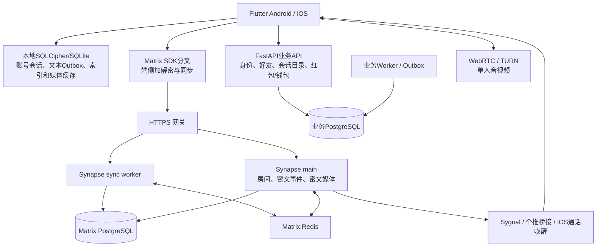

# 即时通讯架构审查与核心功能验收

日期：2026-09-21，Asia/Hong_Kong。冻结源码 `44ba70ef728e50a10df14e9a54bf4e1ae82f6868`。本轮执行代码审查、定向测试、失败探针、生产只读核验及隔离集成；不修复产品、不发布、不进行生产压测。

## 结论

1. **500成员房间可实现，500人活跃聊天尚未通过验收。** 历史501成员/500VU测试没有真实聊天解密，首次升档两路径失败。此次不以历史预热成功或当前生产空闲负载证明容量。
2. **主要能力已有实现，不能声明核心功能全面正常。** 本轮回归与缺陷探针分别报告；已复现搜索续扫、TURN提前刷新两项问题，附件跨进程恢复为明确代码缺口；Android/iOS端到端SLO未测。
3. **应保留通信域与业务域分离的框架，优先补可靠性和证据。** 不建议凭500人的目标就重写协议或全面微服务化。接近成熟IM的关键是消息正确性、移动端恢复、后台通知、端侧性能与可回滚发布，而非功能数量。

## 架构与生产观察

- 当前生产主机：8 vCPU、7900 MiB内存，观察时available约2792 MiB，磁盘可用156 GiB；与其他业务共享资源。瞬时CPU低不等于高负载容量足够。
- Synapse main/sync worker均使用镜像ID `fd9d961a472a0cb1b9fb00ac4290f5868f0f466de1f0d2485241312aebbfc440`，运行10天，重启0、OOM=false；Nginx `/sync|events` 路由到 `synapse-sync-worker:8081`，读取超时600秒。
- 业务API当前镜像 `main-clean-20260920`，ID `08b0ea264c6feb311d3d81b60e960648aebd8085e84e9f81121bd23080741925`；业务worker为另一发布标签。标签不同不是缺陷，但未来契约变更需要API/worker兼容性门禁。
- 观察到核心服务、数据库在同一主机；没有本次故障切换演练证据，不能宣称高可用达标。
- 本地Flutter 3.44.9/Dart 3.12.2；测试位于独立detached工作树。ADB可见Mi6，`com.liuhetong.mobile` 为0.3.103/2147，debug包为0.3.102/2144；未连接主流Android/iPhone。安装版本号不证明与冻结源码同源，未做完整包回拉。

原始证据：[运行资源](artifacts/2026-09-21/im-architecture-audit/production-resources.txt)、[拓扑](artifacts/2026-09-21/im-architecture-audit/production-topology.txt)、[源码基线](artifacts/2026-09-21/im-architecture-audit/baseline.json)。

## 问题清单

| ID/优先级 | 证据等级 | 问题、触发与影响 | 建议与验收 |
|---|---|---|---|
| R1/P1 | 当前代码缺口 | 媒体、视频、转发任务由`MatrixOutgoingWorkCoordinator`内存Map保存；准备/上传期间进程退出后，任务与重试入口不能像文本一样恢复。不能据此断言已被服务端接受的事件丢失。 | 持久化任务描述、稳定txid与可恢复文件引用；重启时按账号核验/恢复。验证准备、上传、服务端已接受但回包丢失三个断点。 |
| R2/P1 | 单测探针已复现 | TTL60秒的TURN凭据到49秒提前刷新失败时被清空，而此时仍未过期；需要中继的新呼叫可能失败。 | 区分刷新时刻与绝对过期时刻；刷新失败仅可保留未过期凭据；到60秒必须拒用。 |
| R3/P2 | 单测探针已复现 | 全局搜索固定预算回填每次从首房间开始，重复记录消耗预算；第二次仍不能覆盖下一个房间。另有200房/每房8000事件窗口，窗口完成不代表全部历史完整。 | 使用账号作用域的续扫游标，分别表达窗口完成/全部完成，向UI说明覆盖范围；同预算多轮最终覆盖全部可读数据。 |
| R4/P2 | 静态风险 | 历史数据源捕获读库异常返回空，回填仍可标complete；后续可能不再重试漏扫房间。 | 空结果与读取失败分开，持久记录未完成房间并重试；验证暂时读库失败后恢复。 |
| R5/P1 | 静态风险 | 长通话ICE restart只调用restartIce；创建连接后没有查到更新TURN配置路径。凭据过期后切网并需要新relay allocation时可能失败。 | 在受控更新凭据后重新协商；真实relay-only长通话、过期、Wi-Fi/蜂窝切换验证。不能由下一通电话刷新测试代替。 |
| R6/P1 | 静态性能风险 | 最大100MB附件仍整块readAsBytes及加密，明文/密文/上传缓冲可能叠加。已有串行与并发限制，但不构成低内存真机峰值证据。 | 测低内存设备RSS、失败恢复与跨房间任务；依据峰值设置账户级字节预算，评估文件流/后台处理。 |
| R7/P1 | 验收缺口 | 生产单宿主共享资源；500真实加密混合媒体、首次同步与集中重连未有合格数据。 | 分离发生器和被测服务，按容量报告补测；依据CPU/数据库池/同步队列瓶颈再扩容。 |

源码定位：R1 `matrix_outgoing_work_coordinator.dart:294,536`与`matrix_e2ee_client.dart:5443`；R2 `turn_credentials_cache.dart:45–70`；R3/R4 `features/search/local_message_search_repository.dart`回填及`matrix_e2ee_client.dart:7391–7407`；R5 SDK `third_party/matrix/lib/src/voip/call_session.dart:1355–1394`；R6 `media_message_service.dart:224,283`及`content_addressed_media.dart:168–173`。行号以冻结源码为准。

R2证据：[探针](artifacts/2026-09-21/im-architecture-audit/turn_refresh_probe_test.dart)、[实际断言失败](artifacts/2026-09-21/im-architecture-audit/turn_refresh_probe.log)。R3证据：[探针](artifacts/2026-09-21/im-architecture-audit/search_progress_probe_test.dart)、[实际断言失败](artifacts/2026-09-21/im-architecture-audit/search_progress_probe.log)。这两项退出码1是有意要求正确行为而暴露现存缺陷，不是编译失败，也未被修复。

## 核心功能矩阵

| 功能 | 当前实现与本轮证据 | 仍不能保证的场景 |
|---|---|---|
| 登录/会话重启 | 账号作用域存储、设备连续性、恢复及生命周期测试 | 双端覆盖安装、密钥变化、系统杀进程后的真实恢复 |
| 文本发送 | SQLite outbox、稳定txid、sending→queued恢复，定向测试 | 真实弱网下全接收端完整性、500人大群时延 |
| 群管理 | 私密加密建群、join/邀请分离、owner/manager权限测试 | 500人批量加入、频繁退群/密钥变化压力 |
| 图片/视频/语音/文件 | 加密及发言权双重检查、上传任务协调；隔离媒体生命周期通过 | 媒体跨进程续传、100MB低内存、真实解密与终端显示一致性 |
| 历史/分页/搜索 | 分页token/恢复测试；搜索续扫探针失败 | 搜索不能声明完整历史可检索 |
| 撤回/未读 | 有本地索引删除及信令尾部处理测试 | 多端、后台、大流量时一致性 |
| 通知与后台唤醒 | event_id_only、通用文案、token更新、个推桥接回归 | Android厂商后台限制、iOS杀进程来电/推送时效 |
| 单人音视频 | 房间/成员/E2EE检查，WebRTC/TURN；TURN探针失败 | 严格NAT、长通话切网、真实声学和中继质量 |
| 红包/转账聊天入口 | 财务UI专项回归；金额状态仍由业务API权威维护 | 本报告不是完整财务审计或生产资金验收 |

## 本次自动化执行结果

| 集合 | 结果 | 证据 |
|---|---|---|
| Flutter群/弱网/同步/搜索等33个文件 | 255通过，退出0 | flutter-focused.log / flutter-focused-result.json |
| Flutter outbox/登录/会话/通知/财务UI | 345通过，退出0 | flutter-lifecycle-finance.log / 对应result.json |
| 容量脚本与移动边界 | 102通过，退出0 | python-focused.log / 对应result.json |
| 业务好友/会话 | 183通过，退出0，1条依赖弃用警告 | business-friendship.log / 对应result.json |
| 个推桥接 | 28通过，退出0，2条依赖弃用警告 | push-tests.log / 对应result.json |
| 新E2EE工具合同 | 最终7通过，退出0 | e2ee-tool-tests.log |
| 搜索续扫/提前刷新探针 | 各1项行为断言失败，退出1 | search_progress_probe.log / turn_refresh_probe.log |

日志位于本报告同日期工件目录。本次未执行全仓verify：独立工作树没有.env，预检已识别配置渲染前置缺失；未为测试复制生产秘密。产品源码未修改，本轮通过项是定向验证，不能声称全仓门禁通过。未执行新APK/IPA构建、真机交互SLO或生产写入。现有Starlette/httpx与Pydantic弃用警告保留，并未通过禁用警告制造通过。

审查顺序：先规格符合性，后质量安全。规格审查要求明确完整容量未完成、nio不是Flutter、40次包含自身回显、去重计数不证明无重复展示，均已在容量报告落实。质量审查发现新工具重复event_id可能缩小分母，已通过红绿回归修正：拒绝重复ID，分母固定为请求消息数×用户数，同时检查accepted/received/decrypted。最终7测试通过；历史2/20条实测数量正确不受影响，工具修订后未重新进行网络实测。两项产品缺陷探针仍保持失败，产品未修复。

## 与成熟IM体验的差距与顺序

- **第一批：可靠性。** 先修R1/R2，建立accepted/received/decrypted/displayed分段计时、故障重放与接收端对账。后台通知、长通话恢复纳入双端发布必测。
- **第二批：性能与完整性。** 修搜索游标/失败恢复，压测成员加载、首次同步和媒体峰值；release/profile验证输入、打开与滚动SLO。不能只优化HTTP平均值。
- **第三批：运维与可维护性。** 发布证据绑定源码、依赖锁、平台包与服务镜像；验证数据库恢复及宿主故障；渐进拆分数千行房间/适配代码，保留稳定接口及回归。
- **隐私取舍保持透明。** 附件确定性加密及复用的可链接性/候选字典猜测风险已在[ADR-0060](../adr/0060-content-addressed-media-dedup.md)明确批准，本轮不当作新发现违规，也不宣称与其他IM隐私模型相同。

容量与未完成门禁详见[容量报告](2026-09-21-im-capacity-audit.md)。本项目SLO是用户批准的验收目标，不是Telegram/微信公开性能数据。
