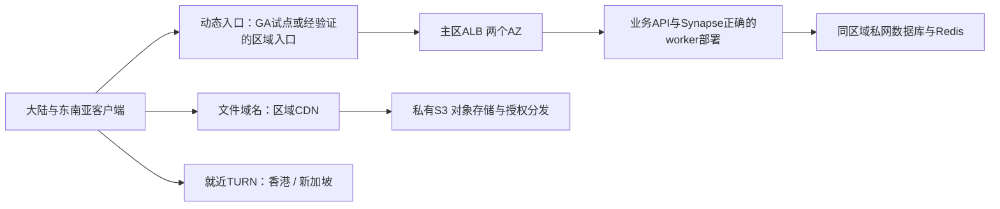

# 中国大陆与东南亚网络架构现场评估

2026-09-23；用户规模：峰值约1000人同时在线，大陆/东南亚各半，东南亚国家及并发视频比例未知。范围仅连接速度和稳定性。用户授权只读连接服务器与评估，未变更配置、DNS、服务或购买资源。

## 现场事实

通过既有SSH跳板读取207.56.8.8，09:12–09:14 UTC。

- 主机8逻辑CPU、约7.7GiB内存，load 0.39/0.57/0.50；可用内存约2.6GiB。不是高峰负载测试，不据此认定容量足够。
- 公网443为Caddy，随后转127.0.0.1:9443的Nginx，再分发business API、Synapse主进程与独立sync worker。外层已提供HTTP/2，并advertise h3；未实测客户端QUIC，不能把HTTP/3当待首次开启功能。
- 服务器解析API/www/admin均指向207.56.8.8，无外部CDN代理迹象。网站、聊天和业务共用主机/出口。
- Synapse media_store_path=/data/media_store，media_storage_providers为空；当前未接Synapse对象存储后端。这里只证明聊天媒体，不等于所有业务子系统都无对象存储。
- Matrix权威server_name为matrix.localhost，public_baseurl为https://liuhetong888.com/。迁移必须保留逻辑身份，不能复制出两个独立homeserver冒充双活。
- TURN与聊天共用liuhetong888.com；UDP/TCP3478、TLS/TCP5349；中继端口49160–49200共41个。41个端口不等于41通电话，容量随allocation/传输模式而变，但必须压测端口耗尽。
- 同机有其他业务及测试恢复容器；本次未停止它们。
- Nginx已对sync关闭response buffering，读取超时600秒。没有看到显式upstream keepalive池；需核对并按路径配置，不能仅凭客户端keepalive_timeout65推断后端连接已复用。
- 物理网口link speed1000Mbps不等于商家保证的公网带宽。3秒观察无新增RX drop/error；历史累计丢包不能直接算公网实时丢包率。不能据此声称出口已满。

## 测量边界

服务器请求自身公网域名API3次均200，TTFB45/106/211毫秒；仅是服务器自身路径，不能当大陆或东南亚用户延迟。
工作站DNS返回28.0.0.44而服务器返回207.56.8.8，显示本地DNS/网络存在映射；3次请求1次200约1.13秒、2次连接超时。即使用--noproxy，仍不能排除系统TUN/透明路由，因此这不是三网质量或源站可用率证据。
尚无中国电信/联通/移动、东南亚真实移动网络、晚高峰或TURN通话指标，不承诺任何加速倍数。

## 推荐架构

首轮以香港ap-east-1为主区候选，新加坡ap-southeast-1作为TURN和灾备候选。两地各半且东南亚国家未知，不把香港认定为测量结论；以两候选的跨运营商晚高峰P95/P99决定主区。不要让每次数据库读写跨香港/新加坡公网。先单区域多AZ，跨区域恢复要有数据复制、提升主库、防双写和客户端重连步骤，不能只用DNS健康检查切到空应用。

GA对动态流量提供AWS网络入口及健康路由，但不承诺大陆跨境链路质量，不是大陆专线。GA支持香港/新加坡，标准endpoint为AWS ALB/NLB/EC2/EIP，不能直接登记当前任意外部IP成为endpoint。用AWS代理绕回旧单机不会解决源站单点，不宜作为最终方案。

### 1000在线的初始采购级别（需要容量验证）

| 层 | 起始建议 | 说明 |
|---|---|---|
| 应用/聊天worker宿主 | 主区2台，每台4vCPU/16GiB，跨AZ；M系x86非CPU积分型 | 示例m7i.xlarge或当地可用同级；采购前核对该区实际库存。按Synapse支持的角色/复制配置部署，不可简单启动两套完整主进程 |
| 入口 | 1套跨AZ ALB；GA小流量A/B试点 | GA无测得改善不默认保留；HTTPS连接复用、健康探测、排空 |
| 数据库 | 与应用同区域私网，独立PostgreSQL，Multi-AZ | 初始4vCPU/16GiB级别作为预算，不是已证明1000人容量；连接池及业务/Matrix隔离保留 |
| Redis | 与应用同区域私网，主从/故障切换 | 业务与Matrix逻辑/权限隔离；与应用恢复流程一起演练 |
| 文件 | 私有S3+一个主CDN | 先迁移公开安装包/静态文件；随后做授权的聊天媒体分发 |
| TURN | 香港、新加坡各至少1个独立公网节点，初始2–4vCPU/4–8GiB | 单节点/区仍有区域局部单点；高可用要求每区2节点或经验证跨区新会话fallback；现有通话不能无损迁移allocation |

机器CPU不是网络速度保证。AWS小实例“up to 12.5Gbps”可能为burst，例m7i.xlarge网络baseline1.562Gbps；同时关注PPS、连接跟踪和互联网网关限制，不能按广告峰值估算持续视频。

### CDN/存储的取舍

- S3是对象存储；单独把磁盘换S3不会自动缩短用户下载路径。CloudFront或Cloudflare缓存命中才会减少回源与主机出口占用。保留单一主CDN，避免默认串联Cloudflare→CloudFront→源站。
- 首先分离下载包和有内容哈希的静态资源，设置长缓存+版本化URL。动态HTML、配置和业务API依语义设置，登录/钱包/同步不可公开缓存。当前www广泛no-store有优化空间，但不能整站一键Cache Everything。
- 聊天媒体有MXC、鉴权、引用/删除及密文完整性语义。Synapse storage provider仅迁移存储不等于浏览器/APP自动直连CDN；需媒体网关鉴权并发放短时签名URL/等价受控分发，保持私有桶。CDN缓存命中也必须经过有效授权检查，不可把用户Authorization当可公开缓存键。
- 大文件上传以后可评估签名直传/可恢复上传，但这是协议改造，不是配置S3即可完成。主区香港桶不在当前S3 Transfer Acceleration支持列表，新加坡在；不要为加速开关盲目引入跨区每次读写。
- 普通Cloudflare代理/Argo可做全球路径A/B；Argo主要优化Cloudflare到源站路径，不保证大陆用户到边缘一段。Cloudflare China Network是Enterprise另购服务，需有效ICP等接入条件。AWS CloudFront China也需单独中国区分发及相应接入条件。它们不是开通普通套餐就自动得到大陆节点。
- 对中国大陆稳定性要求很高时，评估可落地的大陆CDN/动态加速产品及其到境外源站路径。只有静态缓存命中受益，动态请求、冷缓存和上传仍需回源，必须分别验收。不能声称境外AWS+普通CDN保证大陆三网流畅。

### 通话和协议优先事项

- 先将TURN拆至独立DNS-only域名，不经过普通Cloudflare HTTP代理。独立IP可提供UDP3478优先、TLS/TCP443兜底（443已被现有Web使用，不能直接在同IP同端口冲突绑定）。TLS/TCP只是连通性兜底，UDP可用时通常更适合实时媒体。
- 香港/新加坡多TURN候选由ICE实际连通性选择，不能只相信DNS地理位置。某地2个用户都在东南亚时，避免被固定送往远端TURN。
- 开放并验证足够的relay端口、allocation配额和UDP带宽。100对双向视频，假设每人上行1.5Mbps且全部经TURN一次中继，TURN约300Mbps入口+300Mbps出口，尚未计协议开销/重传/余量；这是场景计算，不是1000在线必然用量。群视频/SFU需单独建模。
- sync/API/上传使用分路径超时；ALB默认idle60秒，与现有Nginx600秒并不一致。建议以实际sync等待约25–30秒、边缘idle留足余量为起点，核对GA/ALB/CDN各自限制，测试后台恢复与断线；不要统一把所有超时调成600秒。
- 保留现有HTTP/2，实测HTTP/3是否被客户端使用及UDP443是否可达。IPv6仅在端到端可用时发布AAAA，客户端保留Happy Eyeballs与IPv4回落。DNS TTL缩短不能让现有连接自动切换。
- 优先验证upstream keepalive、上传request buffering按路径关闭的吞吐/重试影响；同机两层代理可后续简化，但省一次loopback远小于跨境绕路。BBR可受控A/B，不作为跨境丢包的万能修复。

## 验收顺序

1. 两主区候选+现源站：大陆电信/联通/移动至少南北多点，以及实际东南亚国家移动/宽带，至少覆盖3天晚高峰。比较直连、GA、选定CDN；保留证书校验。
2. 拆分测DNS、TCP、TLS、带载API TTFB、真实消息端到端延迟、sync重连；媒体测冷/热缓存首字节、完成率、吞吐；通话测ICE成功、relay占比、RTT、jitter/loss。不同指标不能互相替代。
3. 以1000实际在线连接测试，补多设备、群扇出、滚动图片与文件上传混合负载；再按0/50/100对视频场景测TURN，不把1000在线当1000视频。
4. 验证单AZ/节点/入口故障，新请求恢复、已有连接重建、数据库主备和鉴权媒体行为；用实测P95/P99及错误率决策购买和上线。

## 官方核对资料

- [AWS GA工作方式](https://docs.aws.amazon.com/global-accelerator/latest/dg/introduction-how-it-works.html)
- [GA区域支持](https://docs.aws.amazon.com/global-accelerator/latest/dg/preserve-client-ip-address.regions.html)
- [S3加速支持区域](https://docs.aws.amazon.com/AmazonS3/latest/userguide/transfer-acceleration.html)
- [Cloudflare China Network](https://developers.cloudflare.com/china-network/)
- [Cloudflare代理端口](https://developers.cloudflare.com/fundamentals/reference/network-ports/)
- [Argo](https://developers.cloudflare.com/argo-smart-routing/get-started/)
- [CloudFront中国交付](https://aws.amazon.com/cn/developer/application-security-performance/articles/content-delivery-in-china/)
- [CloudFront私有签名分发](https://docs.aws.amazon.com/AmazonCloudFront/latest/DeveloperGuide/private-content-signed-urls.html)
- [EC2网络规格](https://docs.aws.amazon.com/ec2/latest/instancetypes/gp.html)
- [EC2带宽限制](https://docs.aws.amazon.com/AWSEC2/latest/UserGuide/ec2-instance-network-bandwidth.html)
- [ALB超时](https://docs.aws.amazon.com/elasticloadbalancing/latest/application/edit-load-balancer-attributes.html)

证据：[远端只读核查](artifacts/2026-09-23/network-architecture/remote-audit.txt)、[工作站路径限制](artifacts/2026-09-23/network-architecture/workstation-probe.txt)。没有生产变更、没有购买云服务、没有模拟用户私密聊天、没有导出凭据。
