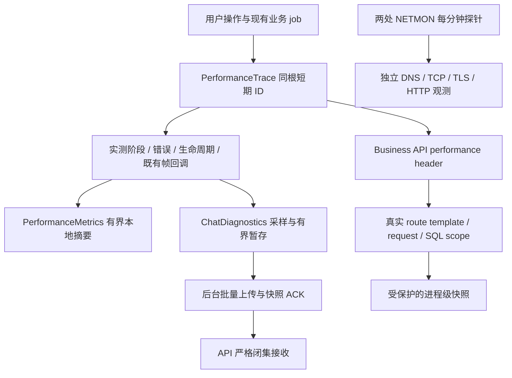

# 网络与全链路诊断修补交付验收

## 范围和证据身份

用户批准完成修复方案并保留数据安装雷电 Debug。本轮工作树为 `C:/Users/Administrator/.codex/worktrees/merge-main-20260926/StarChat`，分支 `codex/network-diagnostics-remediation`，源码起点 `971fb50d193ab1a34610bd7908c2dbf6272db431`。原 main 的历史 WIP 未被覆盖。首轮交付版本为 `0.4.13+2180`；用户视频失败反馈后的纠正源码冻结为 `0.4.13+2181`，正式 Android/iOS 和客户端业务节点切流不在本轮范围。

设计、授权与下一步见[任务记录](../workflow/tasks/2026-09-26-network-diagnostics-remediation.md)。所有本轮非 Git 工件位于 `docs/verification/artifacts/2026-09-26/network-diagnostics-remediation/`，敏感服务器配置与数据库备份只保存在服务器私有目录。

## 诊断审计与复用

原有 `PerformanceMetrics` 已有有界样本、帧预算和分位数；`ChatDiagnostics` 已有认证后低频上传、失败暂存；Matrix 已有 sync phase、Watchdog、Offline First、Persistent Outbox、视频队列、媒体调度和 WebRTC getStats。问题在关联与覆盖：同根多条记录可能去重或误 ACK，未完成操作不可见，首次 finish 后的视频重试无法记录，时间线模型发布被称为可见，通话末次健康样本遮盖此前恶化，生产 API 镜像没有完整的 request/SQL 快照接线。

本轮扩展上述入口：私有 queue entry UUID 负责交付身份，短期 operation UUID 负责业务关联；typed correlation context 持续到既有 job 结束；final、checkpoint、expired 分开；真实 SQL、错误、attempt/window 与语义区间分别记录。没有新建平行 telemetry、帧采集器、媒体调度器或 getStats 解析器。

NETMON 是独立主动探测，不能把其 DNS/TCP/TLS 时间填进某次 App 请求。

## 已支持操作与口径

当前实际 root operation 闭集为 `app_startup`、`app_resume`、`conversation_open`、`message_send`、`matrix_sync`、`media_load`、`recent_pictures_load`、`video_prepare`、`video_poster`、`search`、`search_page_open`、`contacts_load`、`moments_load`、`wallet_load`、`api_request`、`call_setup`、`call_active`、`profile_load`、`chat_list_load`。刷新、上传、解码、头像和恢复沿用已有 stage/counter，不机械添加未接入的根类型。具体生产边界和不能拆分的阶段见[诊断手册](../performance/chatflow-performance-diagnostics.md)；枚举存在不表示每个底层 SDK 阶段均可实测。

- 会话 T0 覆盖列表、搜索、通知的前置 await；本地恢复、导航、Room attach 与 remote sync 分开。
- 同进程视频/Outbox 重试共享根 ID，每次实际 SDK 尝试有 attempt。只在实际重做准备时生成准备尝试；合法 echo 后的最终状态沿业务结算。
- `timeline_published` 是实际模型发布；没有屏幕绘制证据时不生成真实 message first frame。
- 通话沿用 5 秒 getStats，在至少30秒后到达的有效 poll 结算窗口；代表值来自同一最差真实样本。丢包百分比由该样本累计 lost / (lost + received) 计算，不冒称该窗口增量。
- `operation_timings` 按操作、operation/attempt/window 和语义区间分桶。checkpoint/expired 不进入完成分位数；采样上传不能代表全体用户分布。兼容 `operations` 明确为全部已完成 spans。

## 分类、隐私与开销

纯 classifier 只用真实区间与事实：慢 build/raster 或导航归 UI；实际 SQL 查询归 local database；真实 transport 错误归 network；sync processing 归 Matrix；有状态码的 API 长尾归 Business API；排队、缓存、下载、解码、转码分别归媒体对应层；真实 RTT/jitter/loss 与 relay 样本归 WebRTC/TURN。普通35秒 Matrix 长轮询本身不构成瓶颈；无证据为 unknown，多个接近的实测瓶颈为 mixed。

新增字段是 closed enums、受限数值和内部生成 UUID；不接受自由标签/内容 Map。没有记录消息、搜索词、身份、Token、原始 room/event/txid、IP、完整 URL query、媒体 URI/文件路径、SQL/参数、SDP、ICE/TURN 凭据或 E2EE 数据。native poster 日志只输出固定错误类别。

record/mark 只做有界内存更新；不新增业务网络、数据库查询或磁盘 I/O。排序和 JSON 编码只在显式低频快照/后台上传。active 上限100，spool 100条/64KiB/24小时，服务器 series256、每 series512样本、近期关联256。Release 帧默认关闭，认证后 ChatDiagnostics 保持低频采样。Debug 启用本地 metrics 便于测试；尚无 Release/Profile 真机 CPU/内存对照，不能宣称量化开销达标。

## 实际网络与部署证据

NETMON Linux 与阿里云 Windows 已受控安装：原443调度不变，旧SSH22增加3秒连接期限和8秒 service 保护；新 HTTPS 每分钟3次×4目标，域名/固定IP对照、合法 SNI/证书验证、30秒整轮预算、无重叠，16MiB/日×7日。Linux 18:42/18:43 HKT、阿里云18:44/18:45/18:46四组均3/3成功，Windows LastTaskResult0。旧SSH22对次服务器仍为真实 timeout；未伪报恢复。安装前后旧任务及业务容器身份核对见 `network-report.md`。

18:42 HKT 同窗外部探测：雷电4/4 HTTPS200，约92–103ms；宿主机4/4 curl exit35（TLS阶段失败），TCP约21–38ms。宿主机 TLS 异常不能代表雷电故障。两者使用相同8秒连接/12秒总预算；这是短窗公开接口结果，不等于已验证登录、消息、媒体或长期稳定。

生产 API 候选从当时运行 `ea950a2f…` 镜像仅覆盖7个必要文件，worker/schema0088/其他服务保持。r1缺维护依赖、r2旧媒体摘要结构、r3真实两 worker 路由关联缺口均被候选门禁拦截，未凭接收202发布。r4 `sha256:cf7c49260345cb821fc0bb1c9ddcf42b567fcce53b3e4fb81259d8901a26dd53` 于19:13 HKT通过已有 guard API-only 切换，退出0；healthy/零重启、241源文件哈希匹配、worker及其他38容器/schema0088不变。严格HTTPS ready200、匿名诊断401、维护鉴权403/no-store200、真实同连接请求根ID→SQL1/完整归属/null连接等待及启动ERROR0/Traceback0通过。没有用户会话、短信或金融写入。备份恢复137表通过；本次未触发回退，也未故意中断生产做 live rollback。

## 已执行门禁

|门禁|退出码|结果|
|---|---:|---|
|infra 全量|0|224 passed|
|mobile Python 全量|0|238 passed / 1条件 skip|
|客户端核心最终专项|0|46 passed；后续索引暂存联合71 passed|
|Matrix/Outbox B3专项|0|220 passed；最终 echo 结算补丁58 passed|
|B3静态分析|0|No issues found|
|完整Flutter analyze lib test（锁定原依赖）|0|No issues found，最终19:17:47–19:17:59 HKT|
|完整Flutter test test/features/matrix（锁定原依赖）|0|2180 passed / 9条件 skip，19:17:59–19:19:07 HKT|
|完整Flutter test（锁定原依赖）|0|4549 passed / 9条件 skip，19:19:07–19:21:51 HKT|
|API严格协议/SQL专项|0|220 passed / 1 PostgreSQL 条件 skip；后续真实路由修补另记|
|媒体 API 专项|0|24 passed|
|API/Worker 全量|0|2956 passed / 75条件 skip / 1既有Starlette弃用warning，1778.77秒；最后真实route修补另以226专项及真实2worker/生产gate验收|
|API r4严格协议/SQL/真实路由最终专项|0|226 passed / 1 PostgreSQL 条件 skip|
|Matrix sync错误/Watchdog专项|0|43 passed；35秒正常poll不误判，真实错误和本轮增量|
|UI合同 / API import / Compose .env.example|0 / 0 / 0|PASS|
|Alembic heads / offline SQL|0 / 0|单 head；离线生成通过，没有运行生产迁移|
|统一 verify.ps1|1|Repository/Deployment/Template通过，配置渲染因隔离工作树缺 .env 停止；未复制生产凭据凑门禁|

全量 Flutter 在恢复原锁文件后重新分析、Matrix/full均通过；最终 APK 重建18项、保留数据安装和VM回读均已完成，详见下方装机证据。第一次分析6个override annotation info（exit1），修正后完整analyze No issues exit0；第一轮Matrix旧open字符串断言失败，第二轮新增prepare断言写错，已按实际公开接线修正并专项5/5及完整2180通过。工具自动解析的mirror URL和两项依赖升级已恢复，offline --enforce-lockfile通过，所有依赖版本/摘要与基线一致，最终测试/build使用--no-pub。失败日志保留，不冒称前两轮Matrix通过。RED/GREEN 原始日志及独立规格→质量安全审查见任务工件。root现场回读容器镜像cf7c4926…/healthy和正确 `/api/v1/health/ready` HTTPS200 exit0；首次误用无 `/api/v1` 路径所得404只表示验证命令路径错误，日志保留，不作为API故障。

## Debug 2180 构建、安装与运行时证据

- 源码提交：`b74cefc8b98e326cef1871c1ddeb500e22d8f22b`；锁文件 SHA256 `5220715970aa207f7201fbe12b428c30e3e1ef76a0cca7f4bbee3e94f588d68b`。
- 最终包：`0.4.13 / 2180`，`com.liuhetong.mobile.debug`，ARM64 Debug。源码构建、常规DEX/资源/Manifest重建、zipalign、固定签名与验证共18项 exit0；19:28:07 HKT完成。最终SHA256 `8b7b369670293053ca4185121eba036c13a1811f51576d79021832f5823fa3c1`，145,789,227字节；签名证书SHA256 `75b31c66476cd8e2c9319551b49405a1de1e5c23e9a0dbdcc9eb76b52ba61fff`。
- 重建比较：27,317个smali类语义、Manifest、339个native/assets条目未变化；资源条目474且可被aapt解析，resources.arsc已重建。资源门禁不是每项资源值的完整等价证明。
- 19:29:25–19:29:36 HKT，雷电 `emulator-5556` 使用 `adb install -r` exit0覆盖，未卸载或清数据；设备最终APK SHA吻合。firstInstallTime保留 `2026-09-26 04:06:20`，lastUpdateTime `19:29:34`，包元数据build2180。
- 21:40:21 HKT实际Dart VM回读 `appBuildNumber=2180`、`appVersionName=0.4.13`，`ext.chatflow.performance` enabled=true，含语义分位数、在途操作和partial观察；采集exit0。只读静态字段与已有闭集快照，临时ADB转发已移除。初次采集失败分别为VM banner未找到、evaluate不支持及Field属性读取错误；工件采集脚本改用 `getObject(Field).staticValue` 后通过，没有修改APK来制造结果。
- 实际同根记录：好友类别GET在1001ms产生checkpoint，5007ms最终failed，`network_error=tls_failure`、`bottleneck=network_transport`。没有HTTP状态码，不能归因业务API或服务端5xx。6个帧样本中2个慢帧（build慢1/raster慢1）；该请求 `frame_attribution_complete=false`，不能把启动帧归到这条请求，也不能补报0慢帧。
- 19:34的一次带额外profiling参数的诊断启动出现已归属该Debug进程的Debug进程native崩溃（处于ARM64桥接环境，原因未证实）；随后普通启动及VM回读成功。不能声称整个验收窗口零崩溃，崩溃机制和ARM64→x86_64模拟器翻译边界继续保留为限制；不据此改动业务代码或关闭TLS验证。

证据：任务工件 `android-debug/run-20260926-192401/artifact.json`、`verification.json`、`device-install.json`、`runtime-snapshot.json`、`runtime-snapshot-followup.json`。普通启动的ADB Activity WaitTime不是Flutter首帧或Release性能指标。

### 21:41网络故障窗口

21:41:11–21:41:47 HKT同预算对照，宿主机4/4和雷电4/4均curl exit35/TLS失败，域名和合法SNI固定IP结果相同；TCP在约0.28–3.97ms完成，TLS/TTFB/null，无HTTP响应，总耗时约5秒。与19:41雷电4/4成功形成时间窗变化，不能沿用早先成功说明当前网络正常。App的5007ms TLS失败与该窗口一致。

服务器侧严格HTTPS公开ready在约39.8ms返回200，API healthy；宿主机到主IP实际路由经过 `Meta` TUN，代理进程在运行。`--noproxy`只绕过显式HTTP代理，不能绕过这个TUN/NAT。当前证据定位到本机/模拟器共同出口及TLS路径，尚不能证明是指定代理节点、运营商过滤或服务器TLS配置。没有更换业务域名、轮询IP、停止用户代理或绕过证书验证。

证据：`local-network-final.json`、`server-final-public-health.log`。

21:48独立只读审查按本次公开探针的本地端口关联代理控制器，确证该请求经 Match→Selector→Vmess，非DIRECT。该轮TCP4.792ms、严格证书验证HTTP200、总1899.970ms；21:45同目标TCP4.178ms后TLS失败约5秒。这证明共同TUN/代理路径确实存在且间歇恢复，不证明某一代理hop、运营商或服务器配置是最终原因。设备时钟差1秒，全局HTTP代理未设置；TLS日志为握手中断/连接重置，未完成验证时不能凭没有证书错误文字称证书正常。没有修改电脑代理/TUN或路由。

21:45:23实际VM窗口：99个API成功、2个真实TLS失败；会话打开729ms，首帧181ms、本地timeline640ms、2个慢build帧，remote sync已提前完成。一次消息发送成功2102ms：composer→persist238ms、persist→send54ms、Matrix发送1707ms、发送开始→模型发布1808ms，7个慢build帧。这里是模型发布，不冒称真实气泡绘制。11次sync成功，最慢processing6750ms，同一trace记录55个慢帧；另一周期response43ms而processing5079ms。约30秒正常response wait仍不能单独判慢。当前数据证明处理端与网络端各有可测风险，不能据模拟器Debug结论直接重写SDK或宣称Release同样耗时。

21:49受保护服务器快照HTTP200/no-store，只读现有有界窗口，无额外业务查询。按唯一同根ID、单次请求且无重试对齐59条：客户端某朋友圈请求1492ms，服务端16.910ms，真实SQL合计4.055ms/归属完整；另一客户端1473ms、服务端24.962ms/SQL11.628ms。59条服务端request最大103.941ms。这些例子排除了相同请求主要等待在Business API处理或SQL中的解释；客户端剩余时间仍包含传输和客户端调度，不能冒称精确DNS/TLS/网络耗时。只读取一个worker的近期窗口，未匹配不等于丢数据。该worker诊断接收聚合87次202、12次429、10次401，是进程窗口而非本设备分母，不能据此声称当前设备全部补报通过。

21:45:29普通运行进程仍存在、VM可读，当前进程保留日志中Java/native fatal为0；此前19:34:22.974实际native crash保留，不推断profiling参数或libtcb就是根因。源APK与最终重建APK全部native库和Dart kernel字节一致。

追加证据：`local-tun-audit.json/md`、`runtime-native-audit.json/md`、`runtime-tls-audit.json`、`runtime-tls-public-probe.json`、`runtime-summary-final.json`、`server-client-cohort.json`、`client-server-latency-comparison.json`。

## 剩余限制与下一步

1. `13.229.60.153:22` 尚未到认证，需要真实 SSH 入口/云控制台确认；不能确认 PEM 不正确或将其加入发送节点池。
2. 源站和大陆 ECS 不代表电信/移动/联通全部用户。24小时晚高峰及7天数据仍需采集。
3. Flutter/Matrix DNS/TCP/TLS/TTFB、SDK内部 SQL/锁等待、连接池等待、下载与解密独立分界、SDK上传与事件独立分界、真实消息首帧与 WebRTC 首包仍 unsupported/null。
4. SDK内部 poster load 不能保证与父媒体请求同根；foreground 成功的 Outbox context 是100条/5分钟有界保留、到期/驱逐/账号失效清理，并非即时清理。
5. 2180已实际捕获一次会话与消息发送成功；短视频失败/重试、弱网恢复补报和通话窗口仍需用户场景。不能用公开health或单元测试替代这些验收，正式APK/IPA未发布。
6. 客户端/TUN路径出现真实TLS间歇中断，不能凭TCP握手成功称网络已修好；普通运行成功也不能抹去19:34的native crash。代理具体hop与Profile真机处理开销尚待定位。

## 修改文件清单

以下逐文件列出本轮实际变动；测试文件保持业务/隐私边界断言，没有按结果删测试。生产overlay另包含既有main.py/maintenance.py/media metrics，见上方部署清单。

|文件|目的|
|---|---|
|`apps/mobile_flutter/lib/app_home.dart`|统一入口T0、关联上下文、后台Outbox接线|
|`apps/mobile_flutter/lib/core/app_config.dart`|冻结四位编译build 2180，保留ABI归一化|
|`apps/mobile_flutter/lib/core/business_api_performance_client.dart`|通用请求超时真实分类，保留状态与重放事实|
|`apps/mobile_flutter/lib/core/chat_diagnostics.dart`|同根多条queue entry身份、partial上传、慢帧必留与快照ACK|
|`apps/mobile_flutter/lib/core/chat_diagnostics_spool_store.dart`|v3有界暂存、v2迁移及严格partial/索引恢复|
|`apps/mobile_flutter/lib/core/outbox/message_send_scheduler.dart`|既有Outbox job上下文与实际后台发送尝试|
|`apps/mobile_flutter/lib/core/performance_metrics.dart`|有界在途观察与按语义/attempt/window分位数|
|`apps/mobile_flutter/lib/core/performance_trace.dart`|单根上下文、代次隔离、checkpoint/expired、不取消业务|
|`apps/mobile_flutter/lib/core/performance_trace_model.dart`|闭集阶段/错误/partial及真实区间和分类|
|`apps/mobile_flutter/lib/features/matrix/call_controller.dart`|setup与既有call生命周期上下文关联|
|`apps/mobile_flutter/lib/features/matrix/call_quality_monitor.dart`|复用getStats，单调窗口同样本尖峰及空窗口处理|
|`apps/mobile_flutter/lib/features/matrix/matrix_call_adapter.dart`|通过公开可选接口把上下文传给既有质量监控|
|`apps/mobile_flutter/lib/features/matrix/matrix_e2ee_client.dart`|实际SDK/视频准备、缩略图、错误与最终结算诊断|
|`apps/mobile_flutter/lib/features/matrix/matrix_outgoing_work_coordinator.dart`|重试attempt/echo权威终态及隔离诊断回调|
|`apps/mobile_flutter/lib/features/matrix/matrix_sync_phase_metrics.dart`|真实SDK错误、cycle阶段与Watchdog增量|
|`apps/mobile_flutter/lib/features/matrix/matrix_sync_watchdog.dart`|只传真实错误与计数快照，保持恢复策略|
|`apps/mobile_flutter/lib/features/matrix/media_index.dart`|只围绕原db.query观测实测SQL和行数桶|
|`apps/mobile_flutter/lib/features/matrix/prepared_chat_video.dart`|实际转码/准备尝试保留上下文与阶段|
|`apps/mobile_flutter/lib/features/matrix/room_navigation_coordinator.dart`|统一导航传递共享trace与实际attach|
|`apps/mobile_flutter/lib/features/matrix/room_opening_policy.dart`|在前置准备await前启动同根trace|
|`apps/mobile_flutter/lib/features/matrix/room_page.dart`|公开可选Outbox关联接口透传|
|`apps/mobile_flutter/lib/features/matrix/room_timeline_controller.dart`|真实发送/发布阶段、lease失败、同根重试|
|`apps/mobile_flutter/lib/features/matrix/video_poster_extractor.dart`|固定安全错误tag，删除原生错误路径输出|
|`apps/mobile_flutter/lib/features/search/global_search_page.dart`|每次真实搜索新根，不记录搜索词|
|`apps/mobile_flutter/pubspec.yaml`|Debug构建字段：首轮2180、纠正2181、原生环境对照2182|
|`apps/mobile_flutter/test/core/app_config_test.dart`|验证对应真实边界、关联、失败/恢复或隐私约束；具体RED/GREEN见专项与全量日志|
|`apps/mobile_flutter/test/core/business_api_timeout_classification_test.dart`|验证对应真实边界、关联、失败/恢复或隐私约束；具体RED/GREEN见专项与全量日志|
|`apps/mobile_flutter/test/core/chat_diagnostics_observation_test.dart`|验证对应真实边界、关联、失败/恢复或隐私约束；具体RED/GREEN见专项与全量日志|
|`apps/mobile_flutter/test/core/chat_diagnostics_spool_test.dart`|验证对应真实边界、关联、失败/恢复或隐私约束；具体RED/GREEN见专项与全量日志|
|`apps/mobile_flutter/test/core/outbox/message_send_scheduler_test.dart`|验证对应真实边界、关联、失败/恢复或隐私约束；具体RED/GREEN见专项与全量日志|
|`apps/mobile_flutter/test/features/matrix/account_client_selection_test.dart`|验证对应真实边界、关联、失败/恢复或隐私约束；具体RED/GREEN见专项与全量日志|
|`apps/mobile_flutter/test/features/matrix/call_quality_window_test.dart`|验证对应真实边界、关联、失败/恢复或隐私约束；具体RED/GREEN见专项与全量日志|
|`apps/mobile_flutter/test/features/matrix/call_setup_performance_trace_test.dart`|验证对应真实边界、关联、失败/恢复或隐私约束；具体RED/GREEN见专项与全量日志|
|`apps/mobile_flutter/test/features/matrix/matrix_outgoing_work_coordinator_test.dart`|验证对应真实边界、关联、失败/恢复或隐私约束；具体RED/GREEN见专项与全量日志|
|`apps/mobile_flutter/test/features/matrix/matrix_sync_phase_metrics_test.dart`|验证对应真实边界、关联、失败/恢复或隐私约束；具体RED/GREEN见专项与全量日志|
|`apps/mobile_flutter/test/features/matrix/media_index_performance_test.dart`|验证对应真实边界、关联、失败/恢复或隐私约束；具体RED/GREEN见专项与全量日志|
|`apps/mobile_flutter/test/features/matrix/outbox_send_flow_test.dart`|验证对应真实边界、关联、失败/恢复或隐私约束；具体RED/GREEN见专项与全量日志|
|`apps/mobile_flutter/test/features/matrix/profile_message_route_wiring_test.dart`|验证对应真实边界、关联、失败/恢复或隐私约束；具体RED/GREEN见专项与全量日志|
|`apps/mobile_flutter/test/features/matrix/room_open_trace_entry_test.dart`|验证对应真实边界、关联、失败/恢复或隐私约束；具体RED/GREEN见专项与全量日志|
|`apps/mobile_flutter/test/features/matrix/room_opening_policy_test.dart`|验证对应真实边界、关联、失败/恢复或隐私约束；具体RED/GREEN见专项与全量日志|
|`apps/mobile_flutter/test/features/matrix/video_poster_logging_privacy_test.dart`|验证对应真实边界、关联、失败/恢复或隐私约束；具体RED/GREEN见专项与全量日志|
|`apps/mobile_flutter/test/features/search/global_search_page_test.dart`|验证对应真实边界、关联、失败/恢复或隐私约束；具体RED/GREEN见专项与全量日志|
|`apps/mobile_flutter/test/performance/performance_active_trace_test.dart`|验证对应真实边界、关联、失败/恢复或隐私约束；具体RED/GREEN见专项与全量日志|
|`apps/mobile_flutter/test/performance/performance_correlation_context_test.dart`|验证对应真实边界、关联、失败/恢复或隐私约束；具体RED/GREEN见专项与全量日志|
|`apps/mobile_flutter/test/performance/performance_semantic_summary_test.dart`|验证对应真实边界、关联、失败/恢复或隐私约束；具体RED/GREEN见专项与全量日志|
|`apps/mobile_flutter/test/performance/performance_trace_upload_test.dart`|验证对应真实边界、关联、失败/恢复或隐私约束；具体RED/GREEN见专项与全量日志|
|`docs/performance/chatflow-performance-diagnostics.md`|诊断模型、故障判读、口径和unsupported|
|`docs/runbooks/client-diagnostics.md`|v3暂存/闭集partial/422兼容与部署协议|
|`docs/runbooks/netmon-tcp-probe.md`|有界TCP/HTTPS、统计与安装回退手册|
|`docs/superpowers/plans/2026-09-26-network-diagnostics-remediation.md`|按所在目录分别保存计划、任务状态和本轮验收证据|
|`docs/superpowers/specs/2026-09-26-network-diagnostics-remediation-design.md`|批准的修补范围、数据模型、风险和回退设计|
|`docs/verification/2026-09-26-network-diagnostics-remediation.md`|按所在目录分别保存计划、任务状态和本轮验收证据|
|`docs/workflow/tasks/2026-09-26-network-diagnostics-remediation.md`|按所在目录分别保存计划、任务状态和本轮验收证据|
|`packages/api-contracts/openapi/liuhetong-v1.yaml`|严格接收协议和安全快照OpenAPI同步|
|`scripts/netmon_https_probe.py`|分钟域名/固定IP DNS/TCP/TLS/HTTP探测、有界日志|
|`scripts/netmon_tcp_probe.py`|旧SSH22真实3秒期限、失败/缺测准确分母|
|`services/business-api/app/api/client_diagnostics.py`|旧/新严格协议、partial/索引/请求超时与预算|
|`services/business-api/app/api/performance_diagnostics.py`|维护鉴权no-store快照和真实静态路由过滤|
|`services/business-api/app/core/database.py`|原SQLAlchemy hooks请求SQL关联、错误及池快照|
|`services/business-api/app/core/tracing.py`|真实响应时间/路由模板及任务线程背景隔离|
|`tests/business_api/test_client_diagnostics.py`|验证对应真实边界、关联、失败/恢复或隐私约束；具体RED/GREEN见专项与全量日志|
|`tests/business_api/test_performance_snapshot_api.py`|验证对应真实边界、关联、失败/恢复或隐私约束；具体RED/GREEN见专项与全量日志|
|`tests/business_api/test_tracing_metrics.py`|验证对应真实边界、关联、失败/恢复或隐私约束；具体RED/GREEN见专项与全量日志|
|`tests/infra/test_netmon_https_probe.py`|验证对应真实边界、关联、失败/恢复或隐私约束；具体RED/GREEN见专项与全量日志|
|`tests/infra/test_netmon_tcp_probe.py`|验证对应真实边界、关联、失败/恢复或隐私约束；具体RED/GREEN见专项与全量日志|

## 装机反馈与2181修补进度（不能混为已交付）

用户明确新视频发送失败，按原气泡重试一次仍失败。当前2180近100条暂存未找到本次video_prepare，不能将旧文字成功或一般TLS记录当成这段视频的测量。VM认证地址未缓存且日志已滚动，未重启；run-as仅提取诊断键，scope及queue身份不保存。一次180秒既有暂存观察未捕获可关联新视频记录。

新增RED/GREEN缺陷为满队列每次removeLast删掉最新错误，以及legacy新网络错误满载拒收。修补使用既有队列的固定三级索引与实际上传快照冻结，ACK按entry身份移除；68项专项/No issues analyze均exit0，闭集wire/spool不变。有限容量下同级失败仍可FIFO轮换，不承诺无限保留。容量满视频根永久null、forward/prepared和SDK-only重试缺上下文也在补测。Build2181字段已冻结，尚未构建安装或声称完整门禁通过；后续结果单列。

## 2181最终诊断源码冻结

23:07:04 HKT冻结，独立规格及质量安全复核PASS并核对9文件SHA。真实Matrix adapter与logical routing只在实际SDK调用时接入观察；排队/无事件/未知adapter不伪造完成或ACK。满容量仍保留有界匿名根及实际尝试计数；五分钟租约到期和容量淘汰只释放诊断观察，真实SDK Future保持原结果，晚到结果仍归原operationId。页面销毁不伪造timelinePublished；诊断sink/factory/mark异常不改变业务成功或原始错误。不增加查询、网络请求或记录路径I/O。

专项最终28通过、最终小型完成标记保护之前的源码回归321通过，9文件analyze No issues，均exit0；最后完成阶段保护由专项覆盖，随后由root完整门禁再验。初次root Matrix门禁于最终冻结前运行，唯一失败为已修正的throwing-clock完成阶段保护；原日志保留为`flutter-2181-attempt1-*`，不能作为最终2181通过证据。

| 2181增量文件 | 目的 |
| --- | --- |
| `apps/mobile_flutter/lib/core/chat_diagnostics.dart` | 有界三级保留优先级、实际在途冻结及entry身份ACK，错误满载仍可入队 |
| `apps/mobile_flutter/lib/core/performance_trace.dart` | 容量外匿名上下文与回调异常隔离 |
| `apps/mobile_flutter/lib/features/matrix/room_page.dart` | 视频选择根与记录容量解耦 |
| `apps/mobile_flutter/lib/features/matrix/matrix_e2ee_client.dart` | forward/prepared真实SDK调用归同根，可选重试观察公开接口 |
| `apps/mobile_flutter/lib/features/matrix/matrix_room_timeline_adapter.dart` | 实际SDK重试边界透传 |
| `apps/mobile_flutter/lib/features/matrix/logical_conversation_timeline.dart` | 按既有logical routing透传诊断能力 |
| `apps/mobile_flutter/lib/features/matrix/room_timeline_controller.dart` | 重试根、实际ACK、在途租约释放、销毁及observer隔离 |
| `apps/mobile_flutter/lib/core/app_config.dart` / `apps/mobile_flutter/pubspec.yaml` | 四位Build2181元数据 |
| `apps/mobile_flutter/test/core/app_config_test.dart` | 构建显示和ABI版本号合同 |
| `apps/mobile_flutter/test/core/chat_diagnostics_retention_test.dart` | 满载、混合优先级、真实在途冻结及legacy错误保留 |
| `apps/mobile_flutter/test/core/performance_send_context_coverage_test.dart` | 满容量上下文、sink异常及并发过期 |
| `apps/mobile_flutter/test/features/matrix/performance_send_context_coverage_test.dart` | 实际SDK路由、排队/no-op、迟到结果及销毁/异常隔离 |
| `apps/mobile_flutter/test/features/matrix/outbox_send_flow_test.dart` | fake transport公开诊断能力按实际await边界建模 |

装机用采集器只存在verification artifacts，未加入应用：启动时有界等待extension、12字段及嵌套闭集校验、原子保存、2MiB RPC预算、auth URI仅内存。8项stdlib专项exit0，旧闭集快照3份校验通过。采集低频且正常quit后核对ADB forward清理；它不构成真机性能开销验收。

## 2181完整源码门禁（23:13结束）

冻结23:07:04源码通过完整门禁：flutter analyze lib test：No issues found / exit0；flutter test test/features/matrix：2204 passed / 9条件skip / exit0；flutter test：4586 passed / 9条件skip / exit0。执行使用--no-pub，锁文件SHA52207159…未变。23:13再次verify.ps1真实exit1：Repository/Deployment/Template PASS；缺隔离.env使Render-only停止，未导入生产配置。API/infra无新改动，沿用本轮先前2956/224等同输入证据。

证据：[最终门禁](artifacts/2026-09-26/network-diagnostics-remediation/flutter-2181-gates.json)、[冻结源码清单](artifacts/2026-09-26/network-diagnostics-remediation/send-context-source-manifest.json)、[独立审查](artifacts/2026-09-26/network-diagnostics-remediation/coverage-context-review.md)。源码可用于固定身份重建；截至本节仍未声称2181安装或视频恢复。

## 2181装机及真正视频失败边界

源码提交6f11c6038703865fb279471f4a4e1f0dc29c5354。23:21–23:24固定身份ARM64 Debug重建18/18 exit0；最终SHA ed49ba31a8397266ba66f9d7db96936fe2f79cf7e85707dd85eaf7f8c14ed156，145789227 bytes，证书75b31c66…不变。23:26:44–52保留数据安装、正常启动exit0，firstInstallTime仍为04:06:20，安装后device APK SHA相等。VM实读Build2181/metrics enabled；正常quit后forward已清理，owned Y映射已删除。

用户旧视频重试报告“重发失败，请稍后再试”，同期仅有另一条message_send success1665ms/outbox retry_count2，缺少旧视频的可关联失败；不得把该成功归因用户视频。随后用户新选视频，闭集VM捕获根eb2566db…video_prepare failed，总700ms，video_validated225ms，queue wait0，transcode起点431ms，normal native_failure181ms、aggressive native_failure77ms，transcode_until_failure269ms；没有上传/SDK发送阶段。4同期慢帧单独记录；此视频实际阻断层为本地转码，网络原因未进入这条操作。

当前PID保留native日志仅内存处理：IllegalArgumentException、MediaCodec.createDecoderByType/native_setup、AVC codec初始化失败，且有EGL_BAD_MATCH0x3009；EGL与ARM bridge具体因果未证实，不能将同期标记等同于根因。独立同UIDapp_process探针exit0，可创建OMX.google.h264.decoder和encoder，原生系统创建基线正常；它的ABI/SELinux域与Flutter进程可能不同，不能代替configure/真实转码复现。探针不读媒体/账号，临时JAR清理exit0。

下一步Build2182使用已有android-x64路径原生运行，独立x64 APK门禁仍执行18项重建/固定签名验收，不放宽正式ARM64门禁。纠正classifier对快速native失败误落client_ui的口径（已观测失败阶段优先，同期慢帧保留）。现有H.264/AAC及20MB规则、原视频禁止绕过、E2EE保持；这是有证据的进程环境对照，尚未声称2182构建安装或视频恢复。

## 2182最终源码门禁与测试同步修正

分类器21专项及独立规格/质量安全复核通过，只将真实终态、全部native_failure且没有后续成功/上传/发送进展的视频归为media_transcode；不推断codec或桥接原因。四位2182及ABI偏移合同同步更新。

首次完整门禁唯一失败为matrix_room_media_ui_test的关闭source lease后drain断言；旧focused1仍通过，不能称稳定复现。测试原来仅等待约1秒，改为在runAsync内等待真实drain Future（10秒上限）并驱动widget续行；保留加密媒体、关闭lease后继续、一条发送和无异常断言，未改生产发送/E2EE代码。4项focused和analyze exit0，原失败日志保留flutter-2182-attempt1-*。

最终00:32:32–00:38:21 HKT完整门禁：analyze No issues / exit0；Matrix2204 passed / 9条件skip / exit0；全量Flutter4593 passed / 9条件skip / exit0。verify2182仍因隔离.env缺失exit1，前三项政策/模板PASS。API/infra输入未变，复用原2956/224门禁。独立x64门禁额外验证每个.so为ELF64小端machine62，11正反例与10旧合同case exit0；最终真实APK另验ET_DYN，正式ARM门禁未改。截至本节2182尚未构建安装或声称视频恢复。
