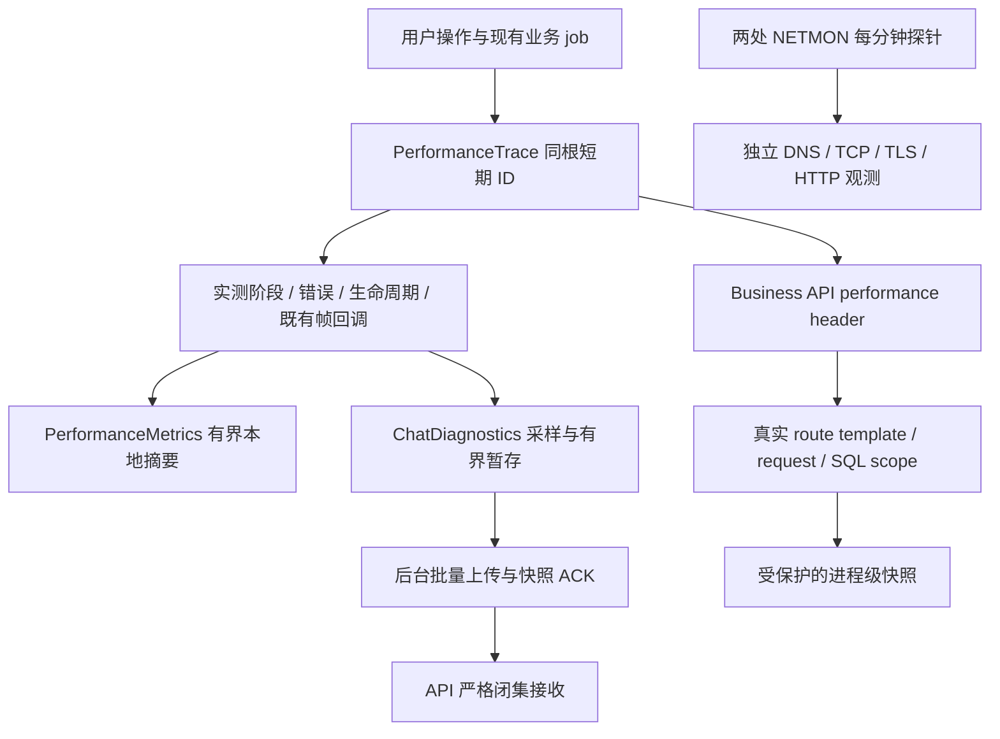

# 网络与全链路诊断修补交付验收

## 范围和证据身份

用户批准完成修复方案并保留数据安装雷电 Debug。本轮工作树为 `C:/Users/Administrator/.codex/worktrees/merge-main-20260926/StarChat`，分支 `codex/network-diagnostics-remediation`，源码起点 `971fb50d193ab1a34610bd7908c2dbf6272db431`。原 main 的历史 WIP 未被覆盖。版本冻结为 `0.4.13+2180`，正式 Android/iOS 和客户端业务节点切流不在本轮范围。

设计、授权与下一步见[任务记录](../workflow/tasks/2026-09-26-network-diagnostics-remediation.md)。所有本轮非 Git 工件位于 `docs/verification/artifacts/2026-09-26/network-diagnostics-remediation/`，敏感服务器配置与数据库备份只保存在服务器私有目录。

## 诊断审计与复用

原有 `PerformanceMetrics` 已有有界样本、帧预算和分位数；`ChatDiagnostics` 已有认证后低频上传、失败暂存；Matrix 已有 sync phase、Watchdog、Offline First、Persistent Outbox、视频队列、媒体调度和 WebRTC getStats。问题在关联与覆盖：同根多条记录可能去重或误 ACK，未完成操作不可见，首次 finish 后的视频重试无法记录，时间线模型发布被称为可见，通话末次健康样本遮盖此前恶化，生产 API 镜像没有完整的 request/SQL 快照接线。

本轮扩展上述入口：私有 queue entry UUID 负责交付身份，短期 operation UUID 负责业务关联；typed correlation context 持续到既有 job 结束；final、checkpoint、expired 分开；真实 SQL、错误、attempt/window 与语义区间分别记录。没有新建平行 telemetry、帧采集器、媒体调度器或 getStats 解析器。

NETMON 是独立主动探测，不能把其 DNS/TCP/TLS 时间填进某次 App 请求。

## 已支持操作与口径

当前实际 root operation 闭集为 `app_startup`、`app_resume`、`conversation_open`、`message_send`、`matrix_sync`、`media_load`、`recent_pictures_load`、`video_prepare`、`video_poster`、`search`、`search_page_open`、`contacts_load`、`moments_load`、`wallet_load`、`api_request`、`call_setup`、`call_active`、`profile_load`、`chat_list_load`。刷新、上传、解码、头像和恢复沿用已有 stage/counter，不机械添加未接入的根类型。具体生产边界和不能拆分的阶段见[诊断手册](../performance/chatflow-performance-diagnostics.md)；枚举存在不表示每个底层 SDK 阶段均可实测。

- 会话 T0 覆盖列表、搜索、通知的前置 await；本地恢复、导航、Room attach 与 remote sync 分开。
- 同进程视频/Outbox 重试共享根 ID，每次实际 SDK 尝试有 attempt。只在实际重做准备时生成准备尝试；合法 echo 后的最终状态沿业务结算。
- `timeline_published` 是实际模型发布；没有屏幕绘制证据时不生成真实 message first frame。
- 通话沿用 5 秒 getStats，在至少30秒后到达的有效 poll 结算窗口；代表值来自同一最差真实样本。丢包百分比由该样本累计 lost/received 计算，不冒称该窗口增量。
- `operation_timings` 按操作、operation/attempt/window 和语义区间分桶。checkpoint/expired 不进入完成分位数；采样上传不能代表全体用户分布。兼容 `operations` 明确为全部已完成 spans。

## 分类、隐私与开销

纯 classifier 只用真实区间与事实：慢 build/raster 或导航归 UI；实际 SQL 查询归 local database；真实 transport 错误归 network；sync processing 归 Matrix；有状态码的 API 长尾归 Business API；排队、缓存、下载、解码、转码分别归媒体对应层；真实 RTT/jitter/loss 与 relay 样本归 WebRTC/TURN。普通35秒 Matrix 长轮询本身不构成瓶颈；无证据为 unknown，多个接近的实测瓶颈为 mixed。

新增字段是 closed enums、受限数值和内部生成 UUID；不接受自由标签/内容 Map。没有记录消息、搜索词、身份、Token、原始 room/event/txid、IP、完整 URL query、媒体 URI/文件路径、SQL/参数、SDP、ICE/TURN 凭据或 E2EE 数据。native poster 日志只输出固定错误类别。

record/mark 只做有界内存更新；不新增业务网络、数据库查询或磁盘 I/O。排序和 JSON 编码只在显式低频快照/后台上传。active 上限100，spool 100条/64KiB/24小时，服务器 series256、每 series512样本、近期关联256。Release 帧默认关闭，认证后 ChatDiagnostics 保持低频采样。Debug 启用本地 metrics 便于测试；尚无 Release/Profile 真机 CPU/内存对照，不能宣称量化开销达标。

## 实际网络与部署证据

NETMON Linux 与阿里云 Windows 已受控安装：原443调度不变，旧SSH22增加3秒连接期限和8秒 service 保护；新 HTTPS 每分钟3次×4目标，域名/固定IP对照、合法 SNI/证书验证、30秒整轮预算、无重叠，16MiB/日×7日。Linux 18:42/18:43 HKT、阿里云18:44/18:45/18:46四组均3/3成功，Windows LastTaskResult0。旧SSH22对次服务器仍为真实 timeout；未伪报恢复。安装前后旧任务及业务容器身份核对见 `network-report.md`。

18:42 HKT 同窗外部探测：雷电4/4 HTTPS200，约92–103ms；宿主机4/4 curl exit35（TLS阶段失败），TCP约21–38ms。宿主机 TLS 异常不能代表雷电故障。两者使用相同8秒连接/12秒总预算；这是短窗公开接口结果，不等于已验证登录、消息、媒体或长期稳定。

生产 API 候选从当时运行 `ea950a2f…` 镜像仅覆盖7个必要文件，worker/schema0088/其他服务保持。r1缺维护依赖、r2旧媒体摘要结构、r3真实两 worker 路由关联缺口均被候选门禁拦截，未凭接收202发布。r4 `sha256:cf7c49260345cb821fc0bb1c9ddcf42b567fcce53b3e4fb81259d8901a26dd53` 于19:13 HKT通过已有 guard API-only 切换，退出0；healthy/零重启、241源文件哈希匹配、worker及其他38容器/schema0088不变。严格HTTPS ready200、匿名诊断401、维护鉴权403/no-store200、真实同连接请求根ID→SQL1/完整归属/null连接等待及启动ERROR0/Traceback0通过。没有用户会话、短信或金融写入。备份恢复137表通过；本次未触发回退，也未故意中断生产做 live rollback。

## 已执行门禁

|门禁|退出码|结果|
|---|---:|---|
|infra 全量|0|224 passed|
|mobile Python 全量|0|238 passed / 1条件 skip|
|客户端核心最终专项|0|46 passed；后续索引暂存联合71 passed|
|Matrix/Outbox B3专项|0|220 passed；最终 echo 结算补丁58 passed|
|B3静态分析|0|No issues found|
|完整Flutter analyze lib test（锁定原依赖）|0|No issues found，最终19:17:47–19:17:59 HKT|
|完整Flutter test test/features/matrix（锁定原依赖）|0|2180 passed / 9条件 skip，19:17:59–19:19:07 HKT|
|完整Flutter test（锁定原依赖）|0|4549 passed / 9条件 skip，19:19:07–19:21:51 HKT|
|API严格协议/SQL专项|0|220 passed / 1 PostgreSQL 条件 skip；后续真实路由修补另记|
|媒体 API 专项|0|24 passed|
|API/Worker 全量|0|2956 passed / 75条件 skip / 1既有Starlette弃用warning，1778.77秒；最后真实route修补另以226专项及真实2worker/生产gate验收|
|API r4严格协议/SQL/真实路由最终专项|0|226 passed / 1 PostgreSQL 条件 skip|
|Matrix sync错误/Watchdog专项|0|43 passed；35秒正常poll不误判，真实错误和本轮增量|
|UI合同 / API import / Compose .env.example|0 / 0 / 0|PASS|
|Alembic heads / offline SQL|0 / 0|单 head；离线生成通过，没有运行生产迁移|
|统一 verify.ps1|1|Repository/Deployment/Template通过，配置渲染因隔离工作树缺 .env 停止；未复制生产凭据凑门禁|

全量 Flutter 在恢复原锁文件后重新分析、Matrix/full均通过；最终 APK/安装尚待完成。第一次分析6个override annotation info（exit1），修正后完整analyze No issues exit0；第一轮Matrix旧open字符串断言失败，第二轮新增prepare断言写错，已按实际公开接线修正并专项5/5及完整2180通过。工具自动解析的mirror URL和两项依赖升级已恢复，offline --enforce-lockfile通过，所有依赖版本/摘要与基线一致，最终测试/build使用--no-pub。失败日志保留，不冒称前两轮Matrix通过。RED/GREEN 原始日志及独立规格→质量安全审查见任务工件。root现场回读容器镜像cf7c4926…/healthy和正确 `/api/v1/health/ready` HTTPS200 exit0；首次误用无 `/api/v1` 路径所得404只表示验证命令路径错误，日志保留，不作为API故障。

## 剩余限制与下一步

1. `13.229.60.153:22` 尚未到认证，需要真实 SSH 入口/云控制台确认；不能确认 PEM 不正确或将其加入发送节点池。
2. 源站和大陆 ECS 不代表电信/移动/联通全部用户。24小时晚高峰及7天数据仍需采集。
3. Flutter/Matrix DNS/TCP/TLS/TTFB、SDK内部 SQL/锁等待、连接池等待、下载与解密独立分界、SDK上传与事件独立分界、真实消息首帧与 WebRTC 首包仍 unsupported/null。
4. SDK内部 poster load 不能保证与父媒体请求同根；foreground 成功的 Outbox context 是100条/5分钟有界保留、到期/驱逐/账号失效清理，并非即时清理。
5. 需要用户在2180自行完成文字、短视频失败/重试、弱网恢复和通话操作，不能用公开 health 或单元测试替代真实发送验收。正式 APK/IPA 未发布。

## 修改文件清单

以下逐文件列出本轮实际变动；测试文件保持业务/隐私边界断言，没有按结果删测试。生产overlay另包含既有main.py/maintenance.py/media metrics，见上方部署清单。

|文件|目的|
|---|---|
|`apps/mobile_flutter/lib/app_home.dart`|统一入口T0、关联上下文、后台Outbox接线|
|`apps/mobile_flutter/lib/core/app_config.dart`|冻结四位编译build 2180，保留ABI归一化|
|`apps/mobile_flutter/lib/core/business_api_performance_client.dart`|通用请求超时真实分类，保留状态与重放事实|
|`apps/mobile_flutter/lib/core/chat_diagnostics.dart`|同根多条queue entry身份、partial上传、慢帧必留与快照ACK|
|`apps/mobile_flutter/lib/core/chat_diagnostics_spool_store.dart`|v3有界暂存、v2迁移及严格partial/索引恢复|
|`apps/mobile_flutter/lib/core/outbox/message_send_scheduler.dart`|既有Outbox job上下文与实际后台发送尝试|
|`apps/mobile_flutter/lib/core/performance_metrics.dart`|有界在途观察与按语义/attempt/window分位数|
|`apps/mobile_flutter/lib/core/performance_trace.dart`|单根上下文、代次隔离、checkpoint/expired、不取消业务|
|`apps/mobile_flutter/lib/core/performance_trace_model.dart`|闭集阶段/错误/partial及真实区间和分类|
|`apps/mobile_flutter/lib/features/matrix/call_controller.dart`|setup与既有call生命周期上下文关联|
|`apps/mobile_flutter/lib/features/matrix/call_quality_monitor.dart`|复用getStats，单调窗口同样本尖峰及空窗口处理|
|`apps/mobile_flutter/lib/features/matrix/matrix_call_adapter.dart`|通过公开可选接口把上下文传给既有质量监控|
|`apps/mobile_flutter/lib/features/matrix/matrix_e2ee_client.dart`|实际SDK/视频准备、缩略图、错误与最终结算诊断|
|`apps/mobile_flutter/lib/features/matrix/matrix_outgoing_work_coordinator.dart`|重试attempt/echo权威终态及隔离诊断回调|
|`apps/mobile_flutter/lib/features/matrix/matrix_sync_phase_metrics.dart`|真实SDK错误、cycle阶段与Watchdog增量|
|`apps/mobile_flutter/lib/features/matrix/matrix_sync_watchdog.dart`|只传真实错误与计数快照，保持恢复策略|
|`apps/mobile_flutter/lib/features/matrix/media_index.dart`|只围绕原db.query观测实测SQL和行数桶|
|`apps/mobile_flutter/lib/features/matrix/prepared_chat_video.dart`|实际转码/准备尝试保留上下文与阶段|
|`apps/mobile_flutter/lib/features/matrix/room_navigation_coordinator.dart`|统一导航传递共享trace与实际attach|
|`apps/mobile_flutter/lib/features/matrix/room_opening_policy.dart`|在前置准备await前启动同根trace|
|`apps/mobile_flutter/lib/features/matrix/room_page.dart`|公开可选Outbox关联接口透传|
|`apps/mobile_flutter/lib/features/matrix/room_timeline_controller.dart`|真实发送/发布阶段、lease失败、同根重试|
|`apps/mobile_flutter/lib/features/matrix/video_poster_extractor.dart`|固定安全错误tag，删除原生错误路径输出|
|`apps/mobile_flutter/lib/features/search/global_search_page.dart`|每次真实搜索新根，不记录搜索词|
|`apps/mobile_flutter/pubspec.yaml`|Debug 0.4.13+2180|
|`apps/mobile_flutter/test/core/app_config_test.dart`|验证对应真实边界、关联、失败/恢复或隐私约束；具体RED/GREEN见专项与全量日志|
|`apps/mobile_flutter/test/core/business_api_timeout_classification_test.dart`|验证对应真实边界、关联、失败/恢复或隐私约束；具体RED/GREEN见专项与全量日志|
|`apps/mobile_flutter/test/core/chat_diagnostics_observation_test.dart`|验证对应真实边界、关联、失败/恢复或隐私约束；具体RED/GREEN见专项与全量日志|
|`apps/mobile_flutter/test/core/chat_diagnostics_spool_test.dart`|验证对应真实边界、关联、失败/恢复或隐私约束；具体RED/GREEN见专项与全量日志|
|`apps/mobile_flutter/test/core/outbox/message_send_scheduler_test.dart`|验证对应真实边界、关联、失败/恢复或隐私约束；具体RED/GREEN见专项与全量日志|
|`apps/mobile_flutter/test/features/matrix/account_client_selection_test.dart`|验证对应真实边界、关联、失败/恢复或隐私约束；具体RED/GREEN见专项与全量日志|
|`apps/mobile_flutter/test/features/matrix/call_quality_window_test.dart`|验证对应真实边界、关联、失败/恢复或隐私约束；具体RED/GREEN见专项与全量日志|
|`apps/mobile_flutter/test/features/matrix/call_setup_performance_trace_test.dart`|验证对应真实边界、关联、失败/恢复或隐私约束；具体RED/GREEN见专项与全量日志|
|`apps/mobile_flutter/test/features/matrix/matrix_outgoing_work_coordinator_test.dart`|验证对应真实边界、关联、失败/恢复或隐私约束；具体RED/GREEN见专项与全量日志|
|`apps/mobile_flutter/test/features/matrix/matrix_sync_phase_metrics_test.dart`|验证对应真实边界、关联、失败/恢复或隐私约束；具体RED/GREEN见专项与全量日志|
|`apps/mobile_flutter/test/features/matrix/media_index_performance_test.dart`|验证对应真实边界、关联、失败/恢复或隐私约束；具体RED/GREEN见专项与全量日志|
|`apps/mobile_flutter/test/features/matrix/outbox_send_flow_test.dart`|验证对应真实边界、关联、失败/恢复或隐私约束；具体RED/GREEN见专项与全量日志|
|`apps/mobile_flutter/test/features/matrix/profile_message_route_wiring_test.dart`|验证对应真实边界、关联、失败/恢复或隐私约束；具体RED/GREEN见专项与全量日志|
|`apps/mobile_flutter/test/features/matrix/room_open_trace_entry_test.dart`|验证对应真实边界、关联、失败/恢复或隐私约束；具体RED/GREEN见专项与全量日志|
|`apps/mobile_flutter/test/features/matrix/room_opening_policy_test.dart`|验证对应真实边界、关联、失败/恢复或隐私约束；具体RED/GREEN见专项与全量日志|
|`apps/mobile_flutter/test/features/matrix/video_poster_logging_privacy_test.dart`|验证对应真实边界、关联、失败/恢复或隐私约束；具体RED/GREEN见专项与全量日志|
|`apps/mobile_flutter/test/features/search/global_search_page_test.dart`|验证对应真实边界、关联、失败/恢复或隐私约束；具体RED/GREEN见专项与全量日志|
|`apps/mobile_flutter/test/performance/performance_active_trace_test.dart`|验证对应真实边界、关联、失败/恢复或隐私约束；具体RED/GREEN见专项与全量日志|
|`apps/mobile_flutter/test/performance/performance_correlation_context_test.dart`|验证对应真实边界、关联、失败/恢复或隐私约束；具体RED/GREEN见专项与全量日志|
|`apps/mobile_flutter/test/performance/performance_semantic_summary_test.dart`|验证对应真实边界、关联、失败/恢复或隐私约束；具体RED/GREEN见专项与全量日志|
|`apps/mobile_flutter/test/performance/performance_trace_upload_test.dart`|验证对应真实边界、关联、失败/恢复或隐私约束；具体RED/GREEN见专项与全量日志|
|`docs/performance/chatflow-performance-diagnostics.md`|诊断模型、故障判读、口径和unsupported|
|`docs/runbooks/client-diagnostics.md`|v3暂存/闭集partial/422兼容与部署协议|
|`docs/runbooks/netmon-tcp-probe.md`|有界TCP/HTTPS、统计与安装回退手册|
|`docs/superpowers/plans/2026-09-26-network-diagnostics-remediation.md`|按所在目录分别保存计划、任务状态和本轮验收证据|
|`docs/superpowers/specs/2026-09-26-network-diagnostics-remediation-design.md`|批准的修补范围、数据模型、风险和回退设计|
|`docs/verification/2026-09-26-network-diagnostics-remediation.md`|按所在目录分别保存计划、任务状态和本轮验收证据|
|`docs/workflow/tasks/2026-09-26-network-diagnostics-remediation.md`|按所在目录分别保存计划、任务状态和本轮验收证据|
|`packages/api-contracts/openapi/liuhetong-v1.yaml`|严格接收协议和安全快照OpenAPI同步|
|`scripts/netmon_https_probe.py`|分钟域名/固定IP DNS/TCP/TLS/HTTP探测、有界日志|
|`scripts/netmon_tcp_probe.py`|旧SSH22真实3秒期限、失败/缺测准确分母|
|`services/business-api/app/api/client_diagnostics.py`|旧/新严格协议、partial/索引/请求超时与预算|
|`services/business-api/app/api/performance_diagnostics.py`|维护鉴权no-store快照和真实静态路由过滤|
|`services/business-api/app/core/database.py`|原SQLAlchemy hooks请求SQL关联、错误及池快照|
|`services/business-api/app/core/tracing.py`|真实响应时间/路由模板及任务线程背景隔离|
|`tests/business_api/test_client_diagnostics.py`|验证对应真实边界、关联、失败/恢复或隐私约束；具体RED/GREEN见专项与全量日志|
|`tests/business_api/test_performance_snapshot_api.py`|验证对应真实边界、关联、失败/恢复或隐私约束；具体RED/GREEN见专项与全量日志|
|`tests/business_api/test_tracing_metrics.py`|验证对应真实边界、关联、失败/恢复或隐私约束；具体RED/GREEN见专项与全量日志|
|`tests/infra/test_netmon_https_probe.py`|验证对应真实边界、关联、失败/恢复或隐私约束；具体RED/GREEN见专项与全量日志|
|`tests/infra/test_netmon_tcp_probe.py`|验证对应真实边界、关联、失败/恢复或隐私约束；具体RED/GREEN见专项与全量日志|
